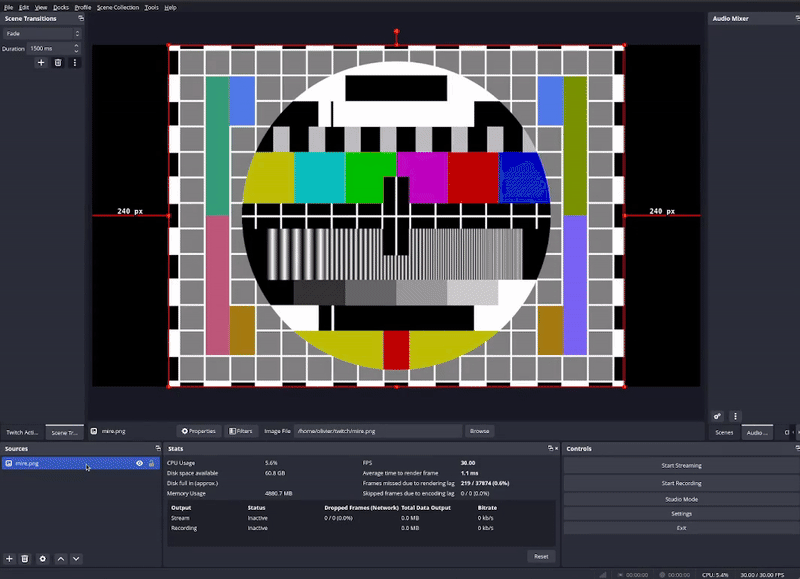
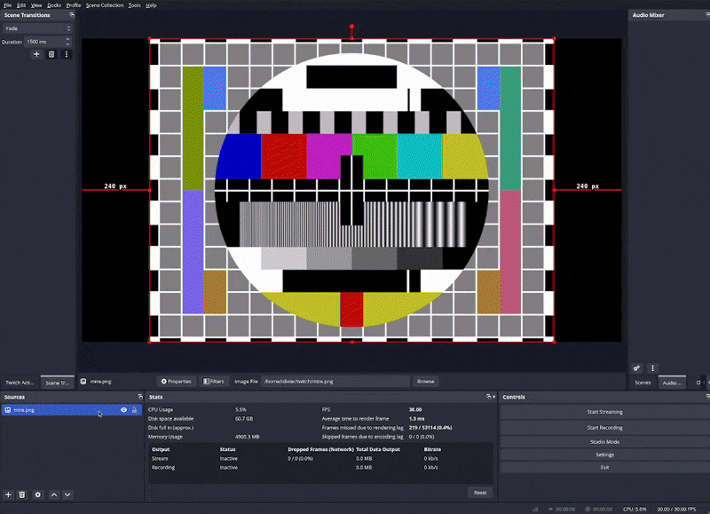

Shadertastic is made to allow everyone to write their own effects, without the hussle of writing an OBS plugin.  
All you need to do is to create two files, one describing the effect and its parameters and the other being the shader.

## Prerequites
- Shadertastic installed in your OBS (see [Installation](../installation.md)),
- some knowledge of HLSL/GLSL (TODO ADD SITE FOR BEGINNERS),
- basic knowledge of the JSON syntax.

## Setting up your configuration
You will need to configure Shadertastic and choose a folder where you will put your own effects. 
If you didn't configure it yet, follow these steps:

- Open OBS
- Go to `Tools > Shadertastic Settings` and choose the folder where you want to put your custom effects:
    
  For this example, we'll assume that you've chosen `C:\Users\John\Documents\Shadertastic-effects`
- Check the `Developer mode` to activate it. It will be useful to hot reload the effects you are creating.
- In the folder you've chosen, add two subfolders `filters` and `transitions`
- You should have this structure at this point:  
  ```
  C:\Users\John\Documents\Shadertastic-effects
    ∟ filters
    ∟ transitions
  ```
- (in the future, optionnal) Download and install the Shadertastic SDK and unzip it in your chosen folder.

## Your first effect: a color swap filter
We will write a very simple filter that swaps the color in this fashion: Red becomes Green, Green becomes Blue, Blue become Red.  
(GIF de l'effet)  
The code of this effect can be found here: AJOUTER LIEN GITHUB OU GIST

- In `C:\Users\John\Documents\Shadertastic-effects\filters`, create a new folder named `color-swap`
- In this folder, add two text files: `meta.json` and `main.hlsl`. The structure should look like this:
  ```
  C:\Users\John\Documents\Shadertastic-effects
    ∟ filters
      ∟ meta.json
      ∟ main.hlsl
  ```
- In `meta.json`, add this:  
  ```json
  {
    "label": "Color Swap",
    "revision": 1,
    "steps": 1,
    "input_time": false,
    "parameters": [
    ]
  }
  ```
  This file describes the filter and its parameters. In this example, we won't need any specific parameter.
  However, some parameters common to all filters will be added automatically (see [Filter Reference](effect-filter.md)).  
  The only common parameter we will actually use in this example is the `image` texture.
- Copy the content of (TODO où qu'on met le template ? dans le dossier data d'obs c'est un peu dla merde...) `template/main.hlsl` in your own `main.hlsl` file:
- At this point, you should have a filter that works. Let's check that. In OBS, create a source of you choice, and add a "Shadertastic Filter".
  Select the effect "Color Swap" in the effect dropdown.
  
  You should see the source being flipped horizontally. This is the effect implemented in the template file. Now, let's change this.
- In the `main.hlsl` file, the only part that you should look at now is the `EffectLinear` function:  
  ```hlsl
  float4 EffectLinear(float2 uv)
  {
    // -----> YOUR CODE GOES HERE <-----
  
    // Here is an basic example that will flip the image
    uv[0] = 1-uv[0];
    return image.Sample(textureSampler, uv);
  }
  ```
  Change it with this content: 
  ```hlsl
  float4 EffectLinear(float2 uv)
  {
    // Pick the currently processed pixel from the image texture and store it as a float4
    float4 pixel = image.Sample(textureSampler, uv);

    // Swap the first 3 values of the pixel R -> G, G -> B, B -> R
    float temp = pixel[2];
    pixel[2] = pixel[1];
    pixel[1] = pixel[0];
    pixel[0] = temp;

    // Return the modified pixel as the result
    return pixel;
  }
  ```
  - Let's look at the changes we've made. 
    In OBS, select the "Shadertastic Filter" you've previously created, and click the "Reload" button.
    (if you don't see it, make sure you have checked the `Developer Mode` in the Shadertastic Settings)
    
  - Congratulation! You just created your very first effect. 
    This is a very simple one, but hopefully you better understand now how to create your own effects.

Now, let's go further and write a transition.
  
---------------------------------

TODO

[//]: # (## How does an effect work with Shadertastic ?)
[//]: # (An effect in Shadertatic is composed of two files:)
[//]: # ()
[//]: # (- `meta.json` that describes the effect and its parameters)
[//]: # (- `main.hlsl` that contains the shader code.)
[//]: # ()
[//]: # ()
[//]: # ()
[//]: # (## Filter or Transition ?)
[//]: # (Shadertastic allow you to make two kind of effects: **Filters** and **Transitions**.)  
[//]: # (These function in a similar manner, but some common parameters are only available in one or the other.)
[//]: # (For example, a transition always has a `time` parameter, going from 0.0 to 1.0.) 
[//]: # (A filter may not have it, depending on its configuration.)
[//]: # ()
[//]: # (## Votre première transition)
[//]: # (- déformer/déplacer l'image ? <-- transi)
[//]: # (AJOUTER LIEN GITHUB OU GIST)
[//]: # (### Setup du dossier du filtre)
[//]: # (### meta.json)
[//]: # (### main.hlsl)
[//]: # ()
[//]: # ()
[//]: # (## Packaging your effect)
[//]: # (Comment créer un fichier .shadertastic)
